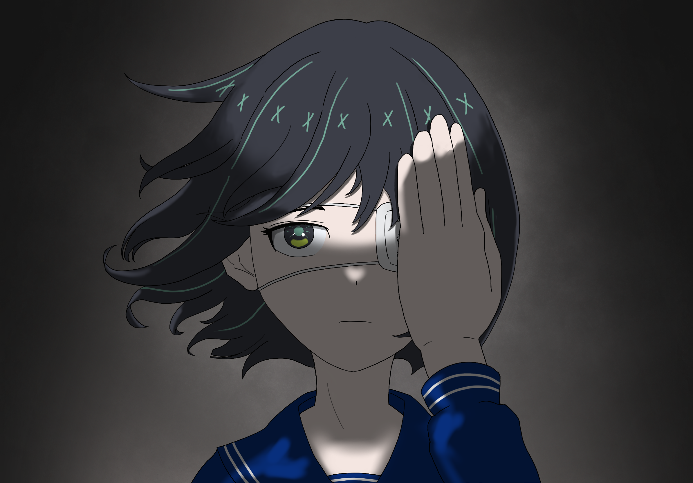

<div id="sayuri-art" align="center">
    <br/>
    
    <h3>Sayuri</h3>
</div>

## Let's ROCK!

Sayuri is a GTP-compliant go engine based on Deep Convolutional Neural Network and Monte Carlo Tree Search. She is strongly inspired by Leela Zero and KataGo. The board data structure, search algorithm and network format are borrowed from Leela Zero in the beginning. Current version follows the KataGo research, the engine supports variable komi and board size now. Some methods you may see my HackMD article (in chinese).

* [開發日誌](https://hackmd.io/@yrHb-fKBRoyrKDEKdPSDWg/BJgfay0Yc)

## Requirements

* Ubuntu or MacOS only
* GCC, Clang, must support C++14 or higher
* CMake 3.15 or later
* Optional: Eigen or OpenBLAS library
* Optional: CUDA 10.x or 11.x library (GCC 7.x passed)
* Optional: cuDNN 7.x or 8.x library
* Optional: Fast Float library

## Default Compiling (Ubuntu or MacOS)

    $ git clone https://github.com/CGLemon/Sayuri
    $ cd Sayuri
    $ git submodule update --init --recursive
    $ mkdir build && cd build
    $ cmake ..
    $ make -j

## Optional Compiling

Accelerate the network forwarding pipe by CPU. OpenBlas or Eigen are required. OpenBlas and Eigen are significantly faster than built-in blas. OpenBlas is recommended on MacOS.

    $ cmake .. -DBLAS_BACKEND=OPENBLAS

or

    $ cmake .. -DBLAS_BACKEND=EIGEN

Accelerate the network forwarding pipe by GPUs. CUDA is required.

    $ cmake .. -DBLAS_BACKEND=CUDA

Accelerate the network forwarding pipe by GPUs. CUDA and cuDNN are both required. It will be faster than CUDA-only in the most cases.

    $ cmake .. -DBLAS_BACKEND=CUDNN

Accelerate to load the network file. Fast Float library is required.

    $ cmake .. -DUSE_FAST_PARSER=1


## Weights

You may download the weights file, opening book and patterns from my [google drive](https://drive.google.com/drive/folders/1cXAoOghgkUfNVZWRzEyvfB4uY_TTbaVH?usp=share_link). Here is the description list. Because I may update the network format or encoder, be sure that you download the correspond weights for the last engine. I do not promise the any file is backward compatible.

| File                    | Description                                    |
| :---------------------- | :--------------------------------------------- |
| Network Weights         | The main weights file, trained on KataGo self-play games. The ```.bin``` postfix is binary version. |
| Opening Book            | It is human-like book, gather from profession games. Force Sayuri to play variable opening moves. It is just fun for playing. |
| MM Patterns             | It is for no-dcnn mode, trained on the games of high level players from KGS. |

<br/>

## Engine Arguments

Here are some useful arguments which you may need.

| Arguments               | Param  | Description                                    |
| :---------------------- | :----- | :--------------------------------------------- |
|  --weights, -w          | string | File with network weights.                     |
|  --patterns             | string | File with patterns.                            |
|  --book, -b             | string | File with opening book.                        |
|  --playouts, -p         | int    | The number of maximum playouts.                |
|  --const-time           | int    | Const time of search in seconds.               |
|  --threads, -t          | int    | The number of threads used.                    |
|  --batch-size, -b       | int    | The number of batches for a single evaluation. |
|  --gpu, -g              | int    | Select a specific GPU device.                  |
|  --resign-threshold, -r | float  | Resign when winrate is less than x.            |
|  --analysis-verbose, -a | None   | Output more search diagnostic verbose.         |
|  --quiet, -q            | None   | Disable all diagnostic verbose.                |
|  --ponder               | None   | Thinking on opponent's time.                   |
|  --friendly-pass        | None   | Do pass move if the engine wins the game.      |
|  --reuse-tree           | None   | Will reuse the sub-tree.                       |
|  --no-dcnn              | None   | Disable network, very weak.                    |
|  --help, -h             | None   | Show the more arguments.                       |
    
<br/>

Default setting: will select reasonable threads and batch size, 10 seconds per move, all GPU devices

    $ ./Sayuri -w <weights file>

Example setting 1: 4 threads, 2 batches and 12800 playouts
    
    $ ./Sayuri -w <weights file> -t 4 -b 2 -p 12800

Example setting 2: quickly and friendly pass game
    
    $ ./Sayuri -w <weights file> -t 1 -b 1 --const-time 1 --friendly-pass --reuse-tree

Example setting 3: set 0 playouts, directly policy output 

    $ ./Sayuri -w <weights file> -t 1 -b 1 -p 0

Example setting 4: use the GPU 0 and GPU 2

    $ ./Sayuri -w <weights file> --gpu 0 --gpu 2

Example setting 5: disable the network forwarding pipe, arond 5k on 9x9, 10k on 19x19. The ```--lcb-reduction``` should be set ```1```

    $ ./Sayuri --patterns <patterns file> --lcb-reduction 1 --no-dcnn

## Graphical Interface

Sayuri is not complete engine. You need a graphical interface for playing with her. She supports any GTP (version 2) interface application. [Sabaki](https://sabaki.yichuanshen.de/) and [GoGui](https://github.com/Remi-Coulom/gogui) are recommended that because Sayuri support some specific analysis commands. 

* Sabaki analysis mode


* GoGui analysis commands


## Analysis Commands

The analysis Commands are useful on the modern GTP interface tool, like Sabaki. It shows the current winrate, best move and the other informations. The engine supports the following GTP analysis commands.

  * `analyze, genmove_analyze [player (optional)] [interval (optional)] ...`
      * The behavior is same as ```lz-analyze```, ```lz-genmove_analyze```.

  * `lz-analyze, lz-genmove_analyze [player (optional)] [interval (optional)] ...`
      * Extension GTP commands of ```lz-analyze``` and ```lz-genmove_analyze```. Support the ```info```, ```move```, ```visits```, ```winrate```, ```prior```, ```lcb```, ```order```, ```pv```, ```scoreLead``` labels. More detail to see [KataGo GTP Extensions](https://github.com/lightvector/KataGo/blob/master/docs/GTP_Extensions.md).


  * `kata-analyze, kata-genmove_analyze [player (optional)] [interval (optional)] ...`
      * Subset of ```kata-analyze``` and ```kata-genmove_analyze```. Support the ```info```, ```move```, ```visits```, ```winrate```, ```prior```, ```lcb```, ```order```, ```pv```, ```scoreLead``` labels. More detail to see [KataGo GTP Extensions](https://github.com/lightvector/KataGo/blob/master/docs/GTP_Extensions.md).


  * Optional Keys
      * All analysis commands support the following keys.
      * ```interval <int>```: Output a line every this many centiseconds.
      * ```minmoves <int>```: There is no effect.
      * ```maxmoves <int>```: Output stats for at most N different legal moves (NOTE: Leela Zero does NOT currently support this field);
      * ```avoid PLAYER VERTEX,VERTEX,... UNTILDEPTH```: Prohibit the search from exploring the specified moves for the specified player, until ```UNTILDEPTH``` ply deep in the search.
      * ```allow PLAYER VERTEX,VERTEX,... UNTILDEPTH```: Equivalent to ```avoid``` on all vertices EXCEPT for the specified vertices. Can only be specified once, and cannot be specified at the same time as ```avoid```.
      * ```ownership True```: Output the predicted final ownership of every point on the board.
      * ```movesOwnership True```: Output the predicted final ownership of every point on the board for every individual move.

## Misc

### What's the Deep Learning technology?

The Deep Convolutional Neural Network (DCNN) is a special technique to provide the human-like thinking. It significantly improves the prediction accuracy of next moves and current winrate. Thanks for deep learning and MCTS, the modern computer Go can beat the top level players on the full size board. Sayuri is anthor Go engine with this technology.

### Why do we need a GPU card?

There are too many matrix operations in the Neural Network forwarding pipe. It is not efficiently to run it on the CPU. Normally, the GPU is 10~20 times faster than the CPU.

### About the ancient technology

Before the AlphaGo (2016s), the most of state-of-the-art computer Go combine the MCTS and MM (Minorization-Maximization). Crazy Stone and Zen use that. Or combining the MCTS and SB (Simulation Balancing). The Eric (predecessor of AlphaGo) and Leela use that. Ray, one of the strongest open source Go engine before AlphaGo, writed by Yuki Kobayashi which is based on the MM algorithm. I am surprised that it can play the game well without much human knowledge and Neural Network. What's more, it can beat high level Go player on 9x9 if we provide it enough computation. But thanks for deep learning technique, the computer Go engine is significantly stronger than before. Sayuri can beat the Ray (v10.0) on 19x19 with only policy network. This result shows the advantage of Neural Network technology.

Although the Neural Network based engines are more powerful, I still recommend you to try some engine with non Neural Network and feel the power of ancient technology. Here is the list.

* [Leela](https://www.sjeng.org/leela.html), need to add the option ```--nonets``` to disable DCNN.
* [Pachi](https://github.com/pasky/pachi), need to add the option ```--nodcnn``` to disable DCNN.
* [Ray](https://github.com/kobanium/Ray), may be strongest open source engine before the 2016s.

I am trying to implement this ancient technique currently. Merge the MM patterns based and the DCNN based technique to provide widely dynamic strength. It should be fun.

## Features

* Provide high level player strength on 19x19, depending on hardware.
* Support Sabaki and GoGui analysis mode.
* Support handicap game.
* Support variable komi and board size (from 7x7 to 19x19).
* Lock-free SMP MCTS.
* Acceleration by multi-core processor and multi-Nvidia GPU.
* Predict the current side-to-move winrate and draw-rate.
* Predict the current side-to-move score lead and death strings.
* Reuse the sub-tree.
* Chinese rules with positional superko.

## Todo

* Sopport Windows platform.
* Support half-float.
* Support NHWC format.
* Support distributed computation.

## Other Linkings

* Go Text Protocol, [https://www.gnu.org/software/gnugo/gnugo_19.html](https://www.gnu.org/software/gnugo/gnugo_19.html)
* Leela Zero, [https://github.com/leela-zero/leela-zero](https://github.com/leela-zero/leela-zero)
* KataGo methods, [https://github.com/lightvector/KataGo/blob/master/docs/KataGoMethods.md](https://github.com/lightvector/KataGo/blob/master/docs/KataGoMethods.md)
* [You Tube](https://www.youtube.com/watch?v=82UclNrXGxg), playing with Pachi.

## License

The code is released under the GPLv3, except for threadpool.h, cppattributes.h, Eigen and Fast Float, which have specific licenses mentioned in those files.

## Contact

cglemon000@gmail.com (Hung-Zhe Lin)
